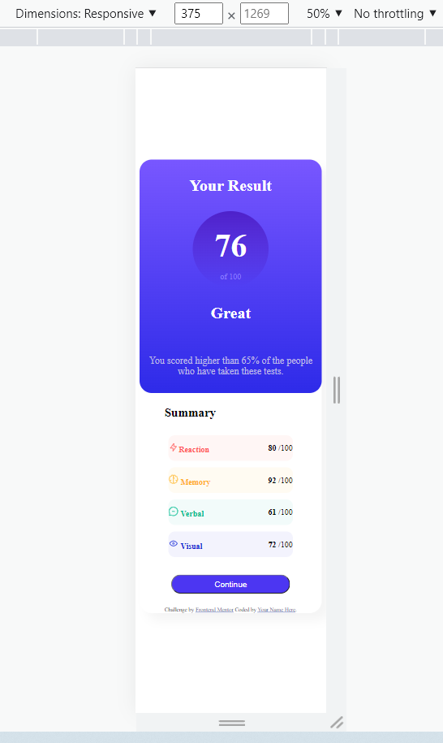
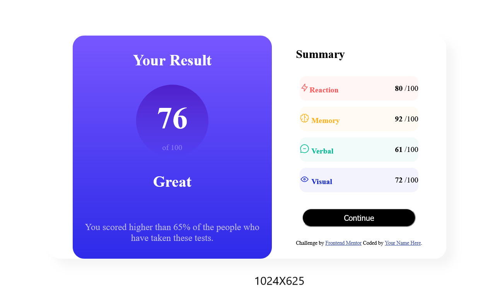

# Frontend Mentor - Results summary component solution

- [Пояснення українською мовою у кінці сторінки](#Пояснення-українською-мовою)

This is a solution to the [Results summary component challenge on Frontend Mentor](https://www.frontendmentor.io/challenges/results-summary-component-CE_K6s0maV). I hope Frontend Mentor challenges help me improve my coding skills by building realistic projects.

## Table of contents

- [Overview](#overview)
  - [The challenge](#the-challenge)
  - [Screenshot](#screenshot)
  - [Links](#links)
- [My process](#my-process)
  - [Built with](#built-with)
  - [What I learned](#what-i-learned)
  - [Continued development](#continued-development)
  - [Useful resources](#useful-resources)
- [Author](#author)
- [Acknowledgments](#acknowledgments)
- [Українська в кінці сторінки](#Українська)

## Overview

### The challenge

### Screenshot





### Links

- Solution URL: [Me solution URL here](https://www.frontendmentor.io/profile/Kava-com)
- Live Site URL: [Live site URL here](https://github.com/Kava-com)

## My process

### Built with

- Semantic HTML5 markup elementary
- CSS custom properties elementary
- Flexbox elementary

### What I learned

I learned elementary of semantic HTML5 markup, CSS custom properties, flexbox.

For example, see below:

```html
<div class="container"></div>
<!--can be used to style elements -->
```

```css
* {
  /*Selects all elements */
  padding: 0;
  box-sizing: border-box;
}
```

### Continued development

I want to continue focusing on in future projects. These could be concepts html, css and Javascript, responsive web design.

### Useful resources

- [slack](https://app.slack.com/) - This is community best practics
- [frontendmentor](https://www.frontendmentor.io/) - This resource gives me the opportunities to learn more about the use frontend and real practice code simple challenges for beginners. Respect!
- [freecodecamp](https://www.freecodecamp.org/) - This recource helped me learn to code
- [developer.mozilla](https://developer.mozilla.org) - This helped me as resourses for developers by developers.
- [w3schools](https://www.w3schools.com/) - This is an amazing resource which helped me better understand html, css. I'd recommend it to anyone still learning technical concept.
- [coolors](https://coolors.co/) - This is an amazing resource which helped me to generate color pallettes.
- [cssgradient](https://cssgradient.io/) - This resource helped me to generate gradients.
- [Chrome DevTools](https://developer.chrome.com/docs/devtools/console/) - This recource help me testing html and css.
- [W3C](https://validator.w3.org/) - This recource help me checks the markup validity of Web documents in HTML and CSS.
- [docs.github](https://docs.github.com/en/get-started) - This recource helped me try to understand githab for the first time in my life. I created three repositories, two folders and deleted them several times, it’s a nightmare.

Most YouTube channels represent the author’s personal point of view. Only documentation should be examined.

## Author

- Website - [Kava-com](https://github.com/Kava-com)
- Frontend Mentor - [@Kava-com](https://www.frontendmentor.io/profile/Kava-com)

## Acknowledgments

I can tip the hat to anyone who created all the training materials and documentation.

Grateful for reading and reply to every constructive comment.

## Пояснення українською мовою

Без знання англійської мови зробити цей проект практично неможливо. Але, кинути все, щоб спочатку вивчити англійську, немає смислу. Тож всю дорогу була відкрита вкладка [Reverso](https://context.reverso.net/%D0%BF%D0%B5%D1%80%D0%B5%D0%B2%D0%BE%D0%B4/). Тут можна перекладати не тільки слова, а й контекст=великі фрагменти тексту.

Постійно були відкриті вкладки [https://developer.mozilla.org/en-US](https://developer.mozilla.org/en-US/docs/Learn) і [https://developer.mozilla.org/ru](https://developer.mozilla.org/ru/docs/Learn), бо української версії не знайшла=немає.

Проект робила у редакторі Visual Studio Code [code.visualstudio](https://code.visualstudio.com/Docs) з розширеннями Live Server, Prettier, Open in browser, Readme Editor.

Вся робота над проектом складалася з трьох переплутаних частин, бо не вдасться чисто вивчити одне і братися за наступе:

- знайти в інтернеті вже готовий такий проект, стягнути його повністю на свій комп, а саме файли html, css (шукала за картинкою і назвою у [slack](https://app.slack.com/) і в [youtube](https://www.youtube.com/), де хтось робив тільки html і css, бо я більше ні в чому не розберуся, щоб зробити проект самостійно);
- розібрати по деталях спочатку html, потім css, щоб зрозуміти значення кожного знаку/літери (кожен елемент має і власне значення, і перебуває у взаємозалежностях);
- написати спочатку html, потім для нього css, вже як свої файли.

Прийшлося на https://www.freecodecamp.org/ пройти модулі:

- Learn HTML by Building a Cat Photo App
- Learn Basic CSS by Building a Cafe Menu
- Learn CSS Color by Building a Set of Colored Markers
- Learn CSS Flexbox by Building a Photo Gallery.

РЕСУРСИ:

- [slack](https://app.slack.com/) - Товариство практиків коду.
- [frontendmentor](https://www.frontendmentor.io/) - Тут знайшла цей проект і братиму наступні. Респект!
- [freecodecamp](https://www.freecodecamp.org/) - Тут вивчаю ази.
- [developer.mozilla](https://developer.mozilla.org) - Це важлива документація.
- [w3schools](https://www.w3schools.com/) - Це добрий ресурс для вивчення.
- [coolors](https://coolors.co/) - Тут робота з кольорами.
- [cssgradient](https://cssgradient.io/) - Тут можна робити градієнти.
- [Chrome DevTools](https://developer.chrome.com/docs/devtools/console/) - Це важливий ресурс для тестування html і css. Вкладка постійно відкрита.
- [W3C](https://validator.w3.org/) - Валідатор HTML і CSS після закінчення всього.
- [docs.github](https://docs.github.com/en/get-started) - Це треба вивчити, бо страшне.

Уникала вивчення, так званої, "лавочної" інформації (моє визначення), коли пенсіонери в парку труть штанами лавки і вивчають гру в шахмати, а в результаті мають тільки простатит. Тобто, для проекту шукала конкретну інформацію, яку зможу використати у конкретно цьому проекті. Хоча мені вже понад 50 років.

Чи буду робити такі проекти/завдання/челенджі діалі? ОБОВ'ЯЗКОВО.

Вдячна за прочитання і відповім на кожен конструктивний зауваження/комент.
